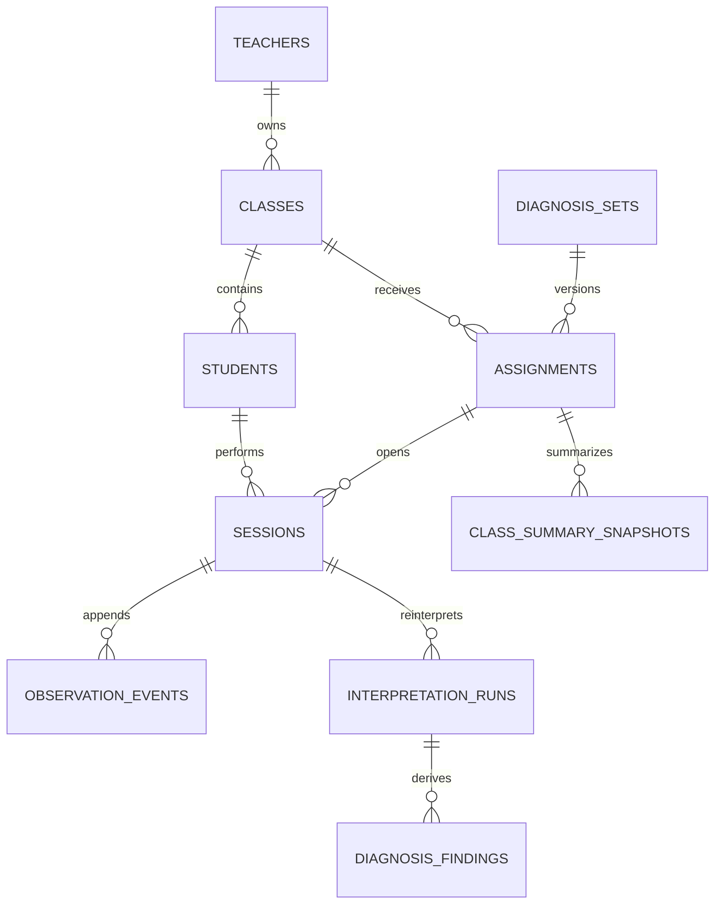

# Middle of Math — 실서비스 전환 설계 계획

작성일: 2026-07-22
상태: 승인됨 · Phase 1 구현 기준
기준 콘텐츠: 2022 개정 교육과정 `3학년 2학기 수학` v1.0.0

## 0. 목적과 결정 기준

Middle of Math를 브라우저 안에서만 동작하는 정적 진단 프로토타입에서, 교사가 반 단위로 진단을 배정하고 학생의 판단 기록을 영구 저장해 수업 판단에 사용할 수 있는 서비스로 전환한다.

Phase 1의 성공 상태는 다음과 같다.

- 교사는 이메일 계정으로 로그인해 자기 클래스만 관리한다.
- 학생은 별도 계정 없이 클래스 코드와 교사가 부여한 필수 번호로 입장한다. 별칭은 선택 표시명이다.
- 학생은 배정된 진단을 시작하거나 이어서 진행할 수 있다.
- 네트워크가 끊겨도 이미 시작한 진단은 계속할 수 있고, 관찰 이벤트는 복구 후 중복 없이 동기화된다.
- 교사는 첫 화면에서 반 전체의 반복 신호를 보고, 학생 개인과 판단 단위 근거까지 내려갈 수 있다.
- 과거 관찰 원자료를 바꾸지 않고 새 해석 엔진으로 다시 해석할 수 있다.

### 결정의 우선순위

기존 자료에 오래된 초안과 현재 구현 결정이 함께 남아 있을 때는 아래 순서로 판단한다.

1. `README.md`, `DESIGN.md`, `REPORT.md`의 현재 원칙
2. `docs/student-math-process-diagnosis.md`의 `0. 현재 구현 기준`과 `16. 구현된 MVP v0`
3. `scripts/student-content-harness.js`, `scripts/runtime-harness.js`가 실제로 강제하는 회귀 방지 조건
4. 위 기준에 반하는 과거 결정 로그

따라서 과거 아이디어 노트에 남은 `이전 단계 허용` 결정은 폐기된 초안이다. 실서비스 학생 흐름도 현재 구현과 같이 **앞으로만 진행**한다.

## 1. 사용자와 서비스 구조

### 1.1 학생

- 사용 환경: 태블릿 우선, 모바일·노트북 대응
- 인증 경험: 로그인 화면 없이 `클래스 코드 + 학생 번호`로 입장
- 핵심 행동: 배정 확인, 진단 시작·이어하기, 한 번에 한 판단 수행, 완료
- 볼 수 없는 정보: 정오답, 오개념 이름, 교사용 해석, 반·다른 학생 데이터
- 데이터 정체성: 실명 대신 클래스 안에서만 의미가 있는 가명 ID

학생 번호는 클래스 안에서 변하지 않는 입장 식별자이고 별칭은 인증에 쓰지 않는 선택 표시명이다. 둘 다 인증 강도가 높은 계정이 아니므로 학생 화면과 저장 데이터에 성적 외 개인정보를 추가하지 않으며, 클래스 코드는 접근 권한 그 자체로 사용하지 않는다.

### 1.2 교사

- 사용 환경: 데스크톱 웹 우선, 태블릿 대응
- 인증: Supabase Auth 이메일 계정
- 핵심 행동: 클래스 생성, 가명 학생 등록, 진단 배정, 반 요약 확인, 교사용 근거 리포트 확인, 학부모 공유본 검토·출력
- 기본 진입 화면: 최근 활성 클래스의 `반 전체 오개념 요약`
- 권한 경계: 본인이 소유하거나 명시적으로 공유받은 클래스만 접근

Phase 1은 클래스당 소유 교사 1명을 기본으로 한다. 공동 교사·학교 조직·관리자 위임은 이후 권한 모델을 확장하되, 도메인 유스케이스가 Supabase 정책에 직접 묶이지 않게 한다.

### 1.3 관리자·콘텐츠 검수자 — 후속 범위

- 진단 세트 초안 검수, 버전 발행, 비활성화, 교육과정 앵커 확인
- 서비스 운영 지표와 오류 확인
- 학생 원자료의 임의 열람은 기본 권한에 포함하지 않음
- 지원 목적으로 필요한 경우에도 명시적인 사유·기간·감사 로그를 전제로 함

### 1.4 개인정보 최소화 원칙

- 학생 실명, 학교 식별 정보, 자유 서술 원문을 기본 수집하지 않는다.
- `students`에는 교사가 부여한 필수 번호와 선택 별칭만 저장한다.
- 이메일은 교사 계정에만 필요하며 Supabase Auth를 원장으로 사용한다.
- 외부 AI에는 학생 이름·학교·개인을 식별할 수 있는 원문을 보내지 않는다.
- 로그, 오류 추적, 분석 도구에도 클래스 코드 원문과 학생 별칭을 남기지 않는다.
- 보존 기간과 삭제 정책은 출시 전에 별도 운영 정책으로 확정한다. 삭제 시 파생 리포트를 먼저 폐기하고, 법적·운영 요건에 따라 이벤트를 삭제하거나 복구 불가능하게 익명화한다.

## 2. 정보 구조(IA)와 화면 목록

### 2.1 전체 구조

```text
학생 앱
입장 → 배정된 진단 → 진단 진행 → 완료
          └──────── 이어하기 ────────┘

교사 앱
로그인 → 반 전체 오개념 요약 → 학생 리포트 ┬→ 교사용 근거 → 판단 단위 근거
                                           └→ 학부모 공유본 → 인쇄/PDF
                   ├→ 진단 배정
                   ├→ 클래스/학생 관리
                   └→ 설정
```

### 2.2 학생 앱

#### S1. 클래스 코드 입장

- 클래스 코드와 학생 번호를 순서대로 입력한다. 별칭은 입장 필드가 아니다.
- 코드는 대소문자·공백을 정규화하되 원문을 로그에 남기지 않는다.
- 실패 문구는 `코드 또는 번호를 다시 확인해 주세요`처럼 계정 존재 여부를 과도하게 드러내지 않는다.
- 성공 시 해당 학생에게 열린 배정과 이어갈 세션만 가져온다.
- 최초 입장에는 네트워크가 필요하다.

#### S2. 배정된 진단 목록

- `새로 시작`, `이어하기`, `완료` 상태를 구분한다.
- 학년·영역·예상 판단 수처럼 학생에게 필요한 정보만 표시한다.
- 오개념, 난이도 판정, 교사용 배정 메모는 노출하지 않는다.
- 진행 중 세션은 마지막 서버 확인 시점과 기기 로컬 큐 상태를 합쳐 복구한다.

#### S3. 진단 진행

- 기존 프로토타입의 한 번에 한 판단 흐름을 유지한다.
- 글자 없는 작은 진행 막대, 문제 또는 조작 도구, 선택지, 선택 후 활성화되는 `다음` 버튼으로 구성한다.
- 학생이 선택해도 자동으로 넘어가지 않는다.
- `잘 모르겠어요`는 현재 판단에 30초 머문 뒤 선택지 아래에 나타난다.
- 네트워크 상태는 문제 풀이를 방해하지 않는 보조 문구로만 알리고, 이벤트는 로컬 큐에 먼저 기록한다.

#### S4. 완료

- `끝까지 참여했어요`와 같은 중립적 완료 문구를 사용한다.
- 점수, 정답률, 오개념, 교사 리포트의 일부를 보여주지 않는다.
- 동기화가 남아 있으면 `기록을 안전하게 저장하고 있어요`를 표시하고, 기기를 바로 닫아도 다음 접속에서 재전송한다.

#### 세션 이어하기와 오프라인 동작

- 최초 입장·진단 콘텐츠 내려받기에는 네트워크가 필요하다.
- 시작된 세션은 콘텐츠 번들과 현재 커서를 IndexedDB에 저장해 오프라인 진행을 허용한다.
- 모든 판단은 `로컬 저장 → 화면 진행 → 백그라운드 동기화` 순서로 처리한다.
- 로컬 이벤트에는 `client_event_id`, `client_seq`, `occurred_at`, `session_id`를 포함한다.
- 서버는 멱등 키로 중복을 제거하고, 순서가 어긋난 이벤트도 `client_seq` 기준으로 재구성한다.
- 서버가 완료 이벤트까지 확인하기 전에는 세션을 `sync_pending`으로 표시한다.
- 같은 학생 번호의 동시 세션이 발견되면 기존 이벤트를 덮어쓰지 않고 별도 세션으로 보존하고 교사에게 충돌 상태를 알린다.

### 2.3 교사 앱

#### T1. 반 전체 오개념 요약 — 첫 화면

- 클래스·최근 배정을 선택한다.
- 가장 먼저 다시 살펴볼 학습 단계 또는 반복 신호를 학생 수와 함께 정렬한다.
- 각 요약 행은 `신호 이름`, `관찰 학생 수`, `해석`, `추천 지도 행동`, `근거 보기`를 포함한다.
- 원자료 초 단위 시간 대신 `오래 고민함`, `충분히 고민함`, `빠르게 확신함`처럼 해석된 신호를 우선한다.
- 한 번의 선택으로 숙달이나 부족을 확정하지 않고 `관찰됨`, `근거 더 필요` 같은 불확실성 언어를 사용한다.

#### T2. 학생 개인 리포트 — 두 용도 분리

- `교사용 근거 리포트`는 가명 번호, 완료 상태, 우선 확인 단계, 반복 신호, 판단 근거, 진단 세트·엔진 버전을 보여준다.
- `학부모 공유 리포트`는 관찰한 강점, 함께 연습할 한두 가지, 가정 질문, 확정 평가가 아니라는 안내만 보여준다.
- 학부모 공유본에는 다른 학생 비교, 반 순위, 원본 이벤트, 오개념 코드, 학생 번호, 클래스 코드를 넣지 않는다.
- Phase 1은 교사가 내용을 검토한 뒤 인쇄하거나 PDF로 저장하는 흐름까지만 제공한다. 보호자 계정과 자동 이메일 발송은 후속 범위다.
- 반 요약에서 선택한 오개념 또는 학습 단계 맥락을 유지한 채 교사용 리포트로 진입한다.

#### T3. 판단 단위 근거

- `교육과정 앵커 → 작은 학습 단계 → 선택·조작 근거` 순서로 보여준다.
- 선택, 첫 선택까지의 시간대, 선택 변경, 확인 시간, `잘 모르겠어요`, 사물 누르기 중복·누락을 해석 문장과 함께 표시한다.
- 원본 이벤트는 감사·디버깅용 접힌 영역으로 두고 기본 리포트를 숫자 로그로 채우지 않는다.

#### T4. 진단 배정

- 클래스 선택 → 발행된 진단 세트 선택 → 시작·마감 설정 → 검토 → 배정 순서다.
- Phase 1은 클래스 전체 배정을 기본으로 한다. 학생별 배정은 데이터 모델이 확장 가능하도록 하되 UI 범위에서 제외한다.
- 이미 시작된 배정은 콘텐츠 버전을 바꾸지 않는다. 새 버전은 새 배정으로 발행한다.

#### T5. 클래스/학생 관리

- 클래스 생성, 입장 코드 회전·만료, 가명 번호 일괄 등록, 비활성화를 제공한다.
- 실명 입력을 유도하지 않고 `번호(필수)`와 `별칭(선택)`을 분리한다.
- 삭제보다 비활성화를 기본으로 해 세션 근거 연결을 보존한다.

#### T6. 설정

- 교사 표시 이름, 이메일 인증 상태, 기본 클래스, 개인정보·보존 정책 링크를 제공한다.
- AI 요약 설정은 Phase 3 전까지 노출하지 않는다.

## 3. 유지할 UX 원칙과 CI 승격

### 3.1 학생 화면 불변 조건

1. 학생 흐름은 앞으로만 진행한다. 이전 단계 버튼·제스처·브라우저 상태 복원으로 과거 판단을 다시 편집하지 않는다.
2. 선택지에는 답 후보 또는 학생이 지금 판단할 짧은 이유만 표시한다.
3. 정오답, 오개념 이름, 교사용 문장, `고른 선택` 같은 진단성 하단 문구를 노출하지 않는다.
4. 분수막대는 사고 도구이지 정답 공개 도구가 아니다. 기준 막대는 보여도 정답 선택지와 같은 막대를 먼저 보여주지 않는다.
5. 선택 후 자동 진행하지 않는다. 학생이 `다음`을 눌러 확정한다.
6. `잘 모르겠어요`는 30초 뒤 선택지 아래에 조용히 나타나며, 누른 뒤에도 힌트나 수치심을 주는 문구를 표시하지 않는다.
7. 학생 화면에서 빨간색을 정오답 피드백으로 사용하지 않는다.
8. 초기 MVP는 잘하는 단계도 자동 생략하지 않는다.

### 3.2 디자인 시스템 계승

`DESIGN.md`의 색·타이포·간격 토큰을 `packages/ui`의 출발점으로 사용한다.

- 학생 앱: 최소 `14px`, 기본 문제 문구 `Body/lg`, 차분한 녹색 포커스, 중립적 표면
- 교사 앱: 스캔 가능한 `Body/sm`까지 허용하되 진단 문장은 충분한 행간 유지
- 간격: 4px 기본 단위와 `--space-1`부터 `--space-12`까지 유지
- 패널 반경: 최대 8px, 중첩 카드와 과도한 그림자 금지
- 모션: 선택 120ms, 단계 전환 220ms, 완료 360ms; `prefers-reduced-motion` 대응
- 다크 모드: 동일한 의미 역할 토큰을 사용하고 상태를 색 하나로만 전달하지 않음

### 3.3 CI 게이트

기존 하네스는 삭제하지 않고 새 구조에 맞게 테스트 책임을 옮긴다.

| 게이트 | 책임 위치 | 실패 조건 |
|---|---|---|
| 학생 콘텐츠 누출 | `packages/content` 스키마·콘텐츠 테스트 | 진단성 문구, 빈 선택지, 저학년 금지 표현 |
| 정답 시각화 누출 | interaction renderer 계약 테스트 | 정답 분수막대·정답 상태 선노출 |
| 전진 전용 흐름 | `apps/student` 통합 테스트 | 이전 단계 UI·과거 판단 편집 가능 |
| 수동 확정 | `apps/student` 통합 테스트 | 선택 즉시 자동 진행, 미선택 다음 활성화 |
| 불확실성 선택 | 타이머 테스트 | 30초 전 노출, 수치심·힌트 문구 동반 |
| 콘텐츠 무결성 | Zod + fixture 테스트 | manifest, 안정 ID, 교육과정 앵커, 상호작용 버전 누락 |
| 이벤트 무결성 | application/adapters 테스트 | 중복 삽입, 이벤트 update/delete 허용, 순서 손실 |
| 데이터 격리 | Supabase RLS 테스트 | 다른 교사 클래스 또는 다른 학생 세션 접근 |
| 아키텍처 경계 | dependency lint | `domain`의 React·Supabase import, apps의 DB 직접 접근 |
| 시각 회귀 | 학생 핵심 화면 스냅샷 | 라이트·다크에서 원칙 위반·텍스트 잘림 |

현재 `counting.js`, `questions.js`의 두 진단 세트와 두 하네스가 `packages/content`의 첫 이관 fixture다. 동작을 다시 작성하기 전에 기존 하네스가 잡는 항목을 새 테스트로 1:1 옮기고, 같은 fixture로 양쪽 구현 결과를 비교한다.

## 4. 클린 아키텍처와 모노레포

### 4.1 목표 구조

```text
apps/
  student/          React + Vite, 태블릿 우선 학생 앱
  teacher/          React + Vite, 교사 대시보드
packages/
  domain/           순수 TypeScript 엔티티·값 객체·해석 규칙·엔진 버전
  application/      유스케이스와 repository/clock/id-generator/AiSummarizer 포트
  adapters/         Supabase, IndexedDB 로컬 큐, 후속 DeepSeek 구현
  content/          버전 있는 진단 세트, manifest, Zod 스키마
  ui/               DESIGN.md 기반 공용 토큰·컴포넌트
```

### 4.2 의존 방향

```text
apps/student ─┐
              ├──> packages/application ───> packages/domain
apps/teacher ─┘              ▲
                             │ 포트 구현
                   packages/adapters

packages/content ──> packages/domain의 공개 타입/값 객체만 사용
packages/ui      ──> 도메인·Supabase를 모르는 표현 계층
```

- `domain`은 React, Vite, 브라우저 API, Supabase SDK를 import하지 않는다.
- `application`은 repository를 인터페이스로만 알고 구체적인 DB 테이블을 모른다.
- `adapters`가 application 포트를 구현한다. Supabase SDK와 IndexedDB 접근은 이 패키지 안에만 둔다.
- `AiSummarizer`도 application 포트로 선언하고, Phase 3의 DeepSeek 구현만 adapters에 둔다.
- apps는 유스케이스를 조합하고 화면 상태를 관리하지만 Supabase 테이블을 직접 query하지 않는다.
- 자체 백엔드로 이전할 때 `adapters` 구현과 배포 조합만 교체하고 domain/application 계약은 유지한다.

### 4.3 주요 도메인 개념

- `Teacher`, `Classroom`, `StudentAlias`, `Assignment`, `DiagnosisSession`
- `DiagnosisSetId`, `DiagnosisSetVersion`, `ContentChecksum`
- `JudgmentId`, `ObservationEvent`, `InteractionDescriptor`
- `InterpretationEngineVersion`, `DiagnosisFinding`, `ClassSummary`
- `SessionStatus`: `not_started | in_progress | sync_pending | completed | abandoned`

도메인 타입은 Supabase row 타입과 분리한다. UUID, 시간 문자열, JSONB를 도메인 값 객체로 변환하는 책임은 adapter mapper가 가진다.

### 4.4 주요 유스케이스

- `JoinClass` — 클래스 코드와 가명 번호를 확인하고 학생용 접근 세션을 만든다.
- `ListAssignedDiagnoses` — 학생에게 열린 배정과 이어갈 세션을 반환한다.
- `StartSession` — 콘텐츠 버전을 고정하고 새 진단 세션을 만든다.
- `ResumeSession` — 서버 이벤트와 로컬 미동기화 이벤트를 병합해 다음 판단을 계산한다.
- `RecordJudgment` — 관찰 이벤트를 먼저 로컬에 append하고 동기화 대상으로 표시한다.
- `SyncObservationEvents` — 멱등 키로 이벤트 묶음을 서버에 append한다.
- `CompleteSession` — 완료 이벤트를 기록하고 서버 확인 후 완료 상태를 확정한다.
- `AssignDiagnosis` — 발행된 콘텐츠 버전을 클래스에 배정한다.
- `GenerateStudentReport` — 특정 엔진 버전으로 세션 이벤트를 해석한다.
- `GenerateClassSummary` — 학생별 finding을 집계하되 근거 수와 불확실성을 유지한다.

### 4.5 관찰 데이터: append-only 이벤트 로그

`ObservationEvent`는 학생이 실제로 한 일을 보존하는 원자료다. 이벤트를 나중 상태로 덮어쓰지 않는다.

```ts
type ObservationEvent = {
  id: string;
  sessionId: string;
  clientEventId: string;
  clientSeq: number;
  occurredAt: string;
  receivedAt?: string;
  eventType:
    | "session_started"
    | "interaction_performed"
    | "choice_selected"
    | "choice_changed"
    | "uncertainty_selected"
    | "judgment_confirmed"
    | "session_completed";
  judgmentId?: string;
  interaction: { type: string; version: number };
  payload: unknown;
};
```

위 타입은 설계 예시이며 실제 구현 시 `eventType + interaction.type/version`별 discriminated union과 Zod 스키마로 구체화한다.

핵심 규칙:

- event row는 insert만 허용하고 update/delete는 일반 사용자 정책에서 금지한다.
- 선택을 바꾸면 기존 선택을 수정하지 않고 `choice_changed`를 추가한다.
- 서버 수신 시간과 기기 발생 시간을 함께 보존한다.
- `session_id + client_event_id` 또는 `session_id + device_id + client_seq`에 unique 제약을 둔다.
- 이벤트에는 해석 결과나 해석 엔진 버전을 쓰지 않는다.
- 콘텐츠 ID·버전·judgment ID·interaction 버전을 함께 고정해 나중에 같은 맥락을 복원한다.

### 4.6 해석 엔진 버전과 재해석

관찰 원자료와 해석 결과의 수명주기를 분리한다.

```text
ObservationEvent[] + DiagnosisSetVersion + InterpretationEngineVersion
  → DiagnosisFinding[]
  → StudentReport
  → ClassSummary
```

- 엔진은 `packages/domain`의 순수 함수로 실행 가능해야 한다.
- 실행마다 `interpretation_run`에 엔진 버전, 콘텐츠 버전, 입력 이벤트 범위, 생성 시점, checksum을 기록한다.
- 과거 세션은 원자료를 바꾸지 않고 새 엔진 버전으로 재실행한다.
- 교사 화면은 기본적으로 최신 승인 엔진 결과를 보여주되, 보고서에 사용 버전을 표시한다.
- 같은 입력과 버전은 같은 finding을 만들어야 한다. AI 문장 요약이 추가되더라도 구조화된 finding은 규칙 기반·결정론적 결과를 원장으로 유지한다.

### 4.7 상호작용 유형 레지스트리

새 조작 도구를 추가할 때 해석 엔진의 중앙 switch 문을 계속 수정하지 않도록 레지스트리 계약을 둔다.

```ts
type InteractionRegistration<TConfig, TEvent> = {
  type: "choice" | "tap-objects" | "fraction-bar" | "number-line" | string;
  version: number;
  configSchema: ZodSchema<TConfig>;
  eventSchema: ZodSchema<TEvent>;
  rendererKey: string;
  extractSignals(event: TEvent, config: TConfig): DomainSignal[];
};
```

초기 등록 유형:

| 유형 | 관찰 예 | 기본 신호 추출 |
|---|---|---|
| `choice` | 선택, 변경, 확인 | 선택 신호, 변경 수, 확인 시간 |
| `tap-objects` | 누른 순서, 중복, 누락 | 일대일 대응, 전체 개수 근거 |
| `fraction-bar` | 기준·조각 선택 | 동치·통분 과정 신호 |
| `number-sequence` | 배열의 빈칸 선택 | 수 이름 순서·규칙 세기 |
| `number-line` | 위치 선택 | 수의 순서·크기 비교 |

렌더러는 apps/ui 쪽에서 `rendererKey`를 해석하고, domain은 DOM 이벤트가 아니라 검증된 관찰 이벤트만 받는다. 새 유형은 레지스트리와 신호 추출기를 추가해 확장하며 기존 엔진 파이프라인을 바꾸지 않는다.

### 4.8 콘텐츠 패키지와 발행

진단 세트는 코드가 아니라 버전 있는 데이터 패키지로 취급한다.

manifest 최소 필드:

- 세트 ID, semantic version, 상태(`draft | review | published | retired`)
- 학년군, 수학 영역, 제목, 예상 문항·판단 수
- 교육과정 앵커와 출처 버전·참조 커밋
- 작은 학습 단계와 선수 관계
- 포함 문항·judgment의 안정 ID
- 사용 interaction type/version 목록
- 콘텐츠 checksum, 생성·검수·발행 시점

발행된 버전은 수정하지 않는다. 수정은 새 버전으로 발행하며, 진행 중인 assignment/session은 시작 시점 버전에 고정한다. `counting.js`, `questions.js`와 기존 두 하네스는 첫 변환 원본이지만, 변환 후 원본과 생성 결과를 비교하는 fixture를 남긴다.

## 5. Supabase 데이터 모델

### 5.1 인증과 학생 입장 경계

- 교사: Supabase Auth 이메일 계정의 `auth.uid()`를 `teachers.id`와 연결한다.
- 학생: 화면상 계정은 없지만 최초 입장 시 앱 내부에서 Supabase anonymous auth 세션을 만든다.
- `join_class` security-definer RPC가 클래스 코드 hash와 학생 번호를 검증하고, 해당 anonymous `auth.uid()`에 한 학생 범위 접근 권한을 연결한다.
- 클래스 코드는 혼동하기 쉬운 문자를 뺀 6자리 영문 대문자·숫자 조합이며, 원문은 DB에 저장하지 않고 조회용 SHA-256과 확인용 bcrypt hash만 저장한다.
- 클래스 코드는 rate limit, 만료, 회전, 실패 횟수 제한을 적용한다.
- 학생 클라이언트에 service-role key를 배포하지 않는다. public anon key와 RLS만 사용한다.

클래스 코드와 번호는 낮은 보증 수준의 입장 수단이다. 이를 전제로 학생 데이터는 가명·최소 데이터로 제한하고, 동시에 같은 학생으로 입장한 기기를 감지해 교사가 세션을 구분할 수 있게 한다.

### 5.2 핵심 테이블

| 테이블 | 핵심 필드 | 제약·설명 |
|---|---|---|
| `teachers` | `id`, `display_name`, `created_at` | `id = auth.users.id`; 이메일 원장은 Auth |
| `classes` | `id`, `teacher_id`, `name`, `join_code_lookup`, `join_code_hash`, `join_code_rotated_at`, `active` | `teacher_id → teachers.id`; 코드 원문 미저장 |
| `students` | `id`, `class_id`, `roster_key`, `display_alias`, `active`, `created_at` | 실명 없음; 번호는 `(class_id, roster_key)` unique, 별칭은 선택 |
| `student_access_grants` | `auth_uid`, `class_id`, `student_id`, `granted_at`, `revoked_at` | 익명 Auth UID와 현재 학생 범위를 연결 |
| `diagnosis_sets` | `id`, `set_key`, `version`, `manifest`, `content`, `checksum`, `status`, `published_at` | `(set_key, version)` unique; published row immutable |
| `assignments` | `id`, `class_id`, `diagnosis_set_id`, `opens_at`, `closes_at`, `status`, `created_by` | Phase 1은 클래스 전체 배정 |
| `sessions` | `id`, `assignment_id`, `student_id`, `student_auth_uid`, `client_session_id`, `status`, `started_at`, `completed_at`, `last_event_seq` | 콘텐츠 버전은 assignment를 통해 고정; active 중복 감지 |
| `observation_events` | `id`, `session_id`, `client_event_id`, `client_seq`, `event_type`, `judgment_id`, `interaction_type`, `interaction_version`, `payload`, `occurred_at`, `received_at` | append-only; `(session_id, client_event_id)` unique |

### 5.3 파생 결과 테이블

파생 결과는 원자료가 아니며 언제든 다시 만들 수 있다.

| 테이블 | 핵심 필드 | 용도 |
|---|---|---|
| `interpretation_runs` | `id`, `session_id`, `engine_version`, `diagnosis_set_version`, `report`, `generated_at` | 교사용 근거 리포트와 해석 기준 추적 |
| `parent_report_exports` | `id`, `session_id`, `interpretation_run_id`, `reviewed_by`, `report`, `generated_at` | 교사가 검토한 학부모 공유본을 교사용 리포트와 분리 저장 |

Phase 1 초기에는 class summary를 요청 시 계산하고 성능 요구가 확인된 뒤 snapshot을 활성화해도 된다. 그러나 `interpretation_runs`의 버전·입력 범위 기록은 처음부터 둔다.

### 5.4 관계



### 5.5 RLS 정책 매트릭스

| 주체 | 읽기 | 쓰기 | 금지 |
|---|---|---|---|
| 교사 | 자기 `teacher_id`의 classes, students, assignments, sessions, events, findings, summaries | 자기 클래스·가명 학생·배정 관리 | 다른 교사 클래스 접근, observation event 수정·삭제 |
| 학생 anonymous uid | 자기에게 발급된 session, 필요한 assignment/content 일부, 자기 event | 자기 active session에 event append, 제한된 상태 전이 | 다른 학생·교사 데이터, findings·class summary, event 수정·삭제 |
| 해석 작업자 | 승인된 session event 읽기, 파생 결과 읽기 | interpretation run·finding·summary 생성 | 원본 event 수정 |
| service role | 운영상 필요한 전체 범위 | 코드 검증·보존 정책·백필 | 클라이언트 노출 |

정책 구현 원칙:

- 교사 정책은 모든 경로에서 `classes.teacher_id = auth.uid()` 연결을 확인한다.
- 학생 event insert 정책은 `sessions.student_auth_uid = auth.uid()`와 active 상태를 함께 확인한다.
- 학생은 `observation_events`에 update/delete 정책을 갖지 않는다.
- 교사도 event는 read-only다.
- join 로직은 일반 테이블 공개 select가 아니라 rate-limited Edge Function/RPC로 감싼다.
- RLS 테스트는 교사 A/B, 학생 A/B, 만료 코드, 완료 세션, 다른 assignment를 포함한 부정 테스트를 우선한다.

### 5.6 동기화와 일관성

- 이벤트 batch append는 전부 성공하거나 안전하게 재시도할 수 있어야 한다.
- `client_event_id` 충돌은 동일 payload면 성공으로 간주하고, 다른 payload면 무결성 오류로 격리한다.
- `last_event_seq`는 캐시이며 원장은 이벤트 로그다.
- session 완료는 `session_completed` 이벤트와 서버 상태 전이를 하나의 서버 트랜잭션으로 처리한다.
- 교사 요약은 완료 세션만 기본 포함하고, 진행 중 데이터는 명확히 구분할 때만 보조로 표시한다.
- 콘텐츠 checksum 불일치 세션은 자동 해석하지 않고 검수 큐로 보낸다.

## 6. Phase 1 핵심 시나리오

### 6.1 교사 준비

1. 교사가 이메일로 가입·로그인한다.
2. 클래스를 만들고 입장 코드를 발급한다.
3. 학생 번호를 필수로 등록하고 필요한 학생에게만 별칭을 붙인다.
4. 발행된 `3학년 2학기 수학` v1.0.0 세트를 클래스에 배정한다.

### 6.2 학생 진단

1. 학생이 클래스 코드와 번호를 입력한다.
2. 앱이 anonymous auth 세션과 서버의 제한된 session grant를 만든다.
3. 학생이 새 진단을 시작하거나 진행 중 세션을 이어간다.
4. 각 판단 이벤트가 IndexedDB에 append된 뒤 서버로 동기화된다.
5. 오프라인이면 큐에 남고, 완료 후에도 재접속 시 전송된다.

### 6.3 교사 해석

1. 완료 세션에 대해 승인된 interpretation engine이 finding을 생성한다.
2. 반 요약이 같은 학습 단계·신호를 학생 수와 근거 수로 집계한다.
3. 교사는 요약 행에서 학생 목록으로, 다시 판단 단위 근거로 내려간다.
4. 엔진이 바뀌면 새 interpretation run을 만들고 원본 이벤트는 유지한다.

## 7. 운영·관찰·보안 기준

- 제품 분석 이벤트와 수학 관찰 이벤트를 분리한다. 제품 분석 도구에는 학생의 수학 선택 payload를 보내지 않는다.
- 오류 추적의 사용자 키는 회전 가능한 내부 ID를 사용하고 학생 별칭·클래스 코드를 제거한다.
- 배포 환경은 local/staging/production Supabase project를 분리한다.
- migration은 version control로 관리하고 production에서 dashboard 수동 변경을 금지한다.
- 콘텐츠 발행과 엔진 배포는 별도 버전·승인 기록을 남긴다.
- 민감하지 않은 운영 지표: 입장 성공률, 동기화 지연, 중복 제거 수, 완료율, 해석 실패율.
- 경보 기준: RLS 테스트 실패, event checksum 불일치, 동기화 적체, 해석 버전 누락.

## 8. 로드맵

### Phase 1 — 실서비스 기반과 반 요약

- 모노레포 재구성
- 기존 두 진단 세트·하네스를 content/domain 테스트로 이관
- Supabase Auth, Postgres, RLS, class join 경계
- 클래스 코드 입장과 가명 학생 관리
- 세션 영구 저장, IndexedDB 오프라인 큐, 멱등 동기화
- 규칙 기반 해석 엔진 버전 관리와 재해석
- 반 전체 오개념 요약 → 학생 → 판단 근거 드릴다운
- 교사용 근거 리포트와 학부모 공유용 인쇄/PDF 리포트 분리
- 라이트·다크와 태블릿 핵심 흐름 시각 회귀 테스트

완료 기준: 서로 다른 두 교사와 두 클래스의 RLS 격리가 자동 검증되고, 네트워크 중단·재전송 후 이벤트 수와 순서가 보존되며, 기존 하네스 원칙을 모두 CI가 강제한다.

### Phase 2 — 문항 제작 스튜디오

- 별도 `apps/studio`에서 내부 제작자·검수자·관리자만 콘텐츠를 편집한다.
- 초등 1–6학년 모델을 지원하되 첫 제작 파일럿은 3학년 2학기로 제한한다.
- 1초 지연 자동 저장, 리비전 기반 충돌 방지, 실제 학생 렌더러 미리보기를 제공한다.
- 작성자와 다른 검수자가 승인한 정확한 리비전만 트랜잭션 RPC로 발행한다.
- 안정 ID·교육과정 앵커·단일 정답·상호작용 호환성·학생 문구 누출을 발행 전에 검사한다.
- 발행본 전체 JSON과 checksum을 Supabase에 불변 저장하고 이전 버전 재배정으로 복구한다.

세부 운영 계약과 완료 게이트는 `docs/phase2-content-studio.md`를 따른다.

### Phase 3 — AI 요약

- `AiSummarizer` 포트와 DeepSeek adapter
- 구조화된 finding을 교사용 짧은 문장으로 요약
- 학생 이름, 학교, 클래스 코드, 자유 서술 원문 미전송
- 전송 전 allowlist projection, 익명 요약 로그, 감사·비용·실패 fallback
- AI 응답은 원자료나 규칙 기반 finding을 덮어쓰지 않는 파생 문장으로만 저장

### Phase 4 — 진단 경험 실험

- 충분한 근거가 있을 때만 적용하는 적응형 단계 생략 실험
- 드래그형 분수막대와 자동 생성형의 데이터 품질 비교
- 보호자 계정·동의 기반 자동 전달과 열람 이력
- 실험군·엔진·콘텐츠 버전을 함께 기록해 결과 재현

## 9. 구현에서 고정한 운영 결정

1. 학생 이벤트와 계정 연결 정보의 보존 기간 및 삭제 요청 처리 방식
2. 같은 브라우저에서는 세션을 자동으로 이어가고, 다른 기기의 새 시도는 기존 시도를 덮어쓰지 않는다.
3. 클래스 코드는 6자리이며 교사가 즉시 회전·비활성화할 수 있다. rate limit 수치는 출시 전 부하·보안 테스트로 확정한다.
4. 완료 전 세션은 반 오개념 집계에서 빼고 `진행 중 학생 수`로만 표시한다.
5. interpretation engine의 승인·rollback 책임자와 재해석 실행 시점
6. 운영 콘텐츠 원장은 Supabase의 불변 발행본 전체 JSON이다. `packages/content`는 시드·export·백업·테스트 fixture로 유지한다.

이 항목들은 도메인 의존 방향을 바꾸지는 않지만, RLS·운영 비용·교실 사용 흐름에 영향을 주므로 구현 전 acceptance test로 고정한다.

## 10. 기존 결정사항 대조 결과

| 기존 기준 | 이 설계의 반영 | 결과 |
|---|---|---|
| 학생은 앞으로만 진행 | S3, UX 불변 조건, CI 게이트 | 일치 |
| 학생에게 진단 문구·정오답 미노출 | S2~S4, 콘텐츠 누출 게이트 | 일치 |
| 정답 분수막대 선노출 금지 | UX 불변 조건, renderer 계약 테스트 | 일치 |
| `잘 모르겠어요` 30초 후 노출 | S3, 타이머 테스트 | 일치 |
| 자동 진행 없음 | S3, 수동 확정 테스트 | 일치 |
| 학생 화면 빨간 정오 피드백 금지 | UX 불변 조건, DESIGN 토큰 계승 | 일치 |
| 실제 반 데이터 후 교사 첫 화면은 반 요약 | T1, Phase 1 범위 | 일치 |
| 현재 프로토타입은 샘플 학생을 섞지 않음 | 실데이터 session만 집계 | 일치 |
| 실명·학교 정보·자유 원문 최소화 | 사용자 구조, RLS, AI 로드맵 | 일치 |
| DeepSeek에는 익명 요약 로그만 | Phase 3 allowlist projection | 일치 |
| 수 세기·분수 2종과 안정 ID 유지 | content 이관·CI fixture | 일치 |

`docs/student-math-process-diagnosis.md` 중간의 과거 `이전 단계 허용` 기록은 같은 문서의 현재 구현 기준과 하네스에 의해 폐기된 것으로 판정했다. 새 설계에는 이전 이동·되돌아가기 이벤트를 도입하지 않는다.
